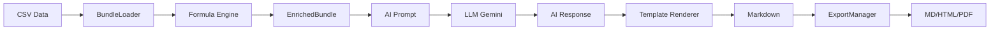

# Quick Start Guide

> **⚠️ Training Project**: This framework is for learning and experimentation. Not recommended for production use.

Get up and running with dproc-framework in 5 minutes.

---

## Prerequisites

Before you begin, ensure you have:

- **Node.js** version 18 or higher
- **npm** (comes with Node.js)
- An **API key** from at least one provider:
  - [Google Gemini](https://makersuite.google.com/app/apikey) (recommended for free tier)
  - [OpenAI](https://platform.openai.com/api-keys)
  - [DeepSeek](https://platform.deepseek.com)

---

## Step 1: Install

```bash
npm install -g @aganitha/dproc-framework
```

**Verify installation:**

```bash
dproc --version
# Expected output: 1.0.0
```

---

## Step 2: Configure API Keys

Run the interactive setup:

```bash
dproc setup
```

**What happens:**

1. You'll be prompted for API keys for each provider
2. Choose a default model for each provider (or accept defaults)
3. Keys are securely stored in `~/.aganitha/.llm-framework/secrets.json`

**Example interaction:**

```
🔑 API Key Setup

? Enter your Gemini API key (or leave empty to skip): ****************************
? Default Gemini model: gemini-2.0-flash-exp

? Enter your OpenAI API key (or leave empty to skip): [skip]
? Enter your DeepSeek API key (or leave empty to skip): [skip]

✅ API keys saved to: /home/user/.aganitha/.llm-framework/secrets.json
✅ Active provider: gemini
```

**Tip:** You only need one provider to get started. Gemini offers a generous free tier.

---

## Step 3: Create Your First Project

Create a project from the sales template:

```bash
dproc init my-first-report --template sales
```

**Output:**

```
🚀 Initializing project: my-first-report

✅ Project created: /path/to/my-first-report

➡️ Next steps:
  cd my-first-report
  dproc generate       # Generate report
```

**What was created:**

```
my-first-report/
├── dproc.config.json       # Project configuration
├── spec.yml                # Report structure
├── data/
│   └── sample-sales.csv    # Sample dataset (8 records)
├── prompts/
│   └── executive-summary.md # AI prompt template
├── templates/
│   └── sales-report.njk     # Report layout template
└── output/                  # Reports will be generated here
```

---

## Step 4: Generate Your First Report

Navigate to the project and generate:

```bash
cd my-first-report
dproc generate
```

**What happens:**

1. Loads `sample-sales.csv` (8 records)
2. Calculates formulas: total revenue, average deal, top product
3. Sends prompt to AI (Gemini) for analysis
4. Renders report template with AI insights
5. Exports to Markdown, HTML, and PDF

**Output:**

```
⠹ Loading configuration...
✔ Configuration loaded

⠹ Retrieving API credentials...
✔ API credentials retrieved: gemini (gemini-2.0-flash-exp)

⠹ Loading dataset...
✔ Dataset loaded: 8 records, 5 columns

⠹ Computing fields and formulas...
✔ Fields computed: 2 custom, 3 computed

⠹ Generating report with gemini...
✔ Report generated successfully

⠹ Exporting to multiple formats...
✔ Export complete

✅ Report generation complete!

📄 Generated files:
  MD     ./output/report.md (3.2 KB)
  HTML   ./output/report.html (8.7 KB)
  PDF    ./output/report.pdf (45.1 KB)

⏱️  Total time: 12.3s
```

---

## Step 5: View Your Report

**Option A: Open in browser**

```bash
open output/report.html    # macOS
xdg-open output/report.html # Linux
start output/report.html    # Windows
```

**Option B: Use the Web UI**

```bash
dproc serve
```

Then visit http://localhost:5555 in your browser to:

- Browse all projects
- Generate reports with one click
- Preview reports with interactive components
- Download PDF versions

---

## Understanding the Generated Report

### Report Structure

Your report contains:

1. **Header Section**

   - Report name: "my-first-report Sales Report"
   - Company: "Your Company"
   - Period: "Q1 2025"
   - Generated timestamp

2. **Executive Summary** _(AI-Generated)_

   - 2-paragraph analysis
   - Overall performance assessment
   - Key trends identified
   - Top product highlighted

3. **Key Performance Indicators**

   - Total Revenue: $68,600 (from SUM formula)
   - Top Product: "Enterprise Widget Pro" (from TOP formula)
   - Avg Deal Size: $8,575 (from AVG formula)
   - Total Orders: 8

4. **Data Overview**
   - Source file path
   - Record count
   - Column count

### How It Works



1. **Data Loading**: CSV parsed into records
2. **Formula Computation**: Custom fields + computed metrics
3. **AI Analysis**: Prompt rendered with data, sent to LLM
4. **Template Rendering**: AI insights + data merged into template
5. **Export**: Generated markdown converted to HTML and PDF

---

## Customizing Your Report

### Use Your Own Data

Replace the sample data with your own CSV:

```bash
cp ~/Downloads/my-sales-data.csv data/sample-sales.csv
dproc generate
```

**CSV Requirements:**

- Must have headers in first row
- Columns used in formulas must exist (e.g., `revenue`, `product`)
- Dates should be in ISO format (YYYY-MM-DD) or MM/DD/YYYY

### Modify Computed Fields

Edit `dproc.config.json`:

```json
{
  "fields": {
    "computed": [
      { "name": "total_revenue", "function": "SUM(revenue)" },
      { "name": "avg_revenue", "function": "AVG(revenue)" },
      { "name": "max_deal", "function": "MAX(revenue)" },
      { "name": "min_deal", "function": "MIN(revenue)" }
    ]
  }
}
```

**Available Functions:**

- `SUM(column)` - Total of numeric column
- `AVG(column)` - Average of numeric column
- `COUNT()` - Count all records
- `MIN(column)`, `MAX(column)` - Min/max values
- `TOP(groupCol, valueCol, N)` - Top N items by value
- `MEDIAN(column)`, `MODE(column)`, `STDEV(column)` - Statistics

### Customize the AI Prompt

Edit `prompts/executive-summary.md`:

```markdown
# Executive Summary Generation

You are a senior business analyst. Write a concise executive summary.

## Performance Metrics

- Total Revenue: ${{total_revenue}}
- Average Deal: ${{avg_revenue}}
- Largest Deal: ${{max_deal}}

## Sample Transactions



- {{record.date}}: {{record.product}} - ${{record.revenue}}
  

## Instructions

Write a 3-paragraph summary that:

1. Opens with overall performance vs expectations
2. Identifies the top-performing product and explains why
3. Highlights any concerning trends
4. Ends with one actionable recommendation

Output in markdown format only, 200-250 words.
```

**Tips:**

- Use `{{variable}}` syntax to insert data
- Use `` loops to iterate over records
- Keep prompts specific and constrained
- Request structured output formats

### Change Output Formats

Edit `dproc.config.json`:

```json
{
  "output": {
    "formats": ["md", "html"], // Skip PDF for faster generation
    "destination": "./output"
  }
}
```

---

## Common Tasks

### Switch LLM Provider

```bash
# Switch to OpenAI
dproc use openai

# Switch back to Gemini
dproc use gemini

# Check current provider
dproc config list
```

### Validate Your Data

Before generating, check your data structure:

```bash
dproc validate data/sample-sales.csv
```

**Output:**

```
🔍 Validating: data/sample-sales.csv

✓ File loaded successfully
  Records: 8
  Columns: 5
  date, product, revenue, region, sales_rep

📊 Column Types:
  🔢 revenue               number
  📅 date                  date
  📝 product               string
  📝 region                string
  📝 sales_rep             string

✅ Validation passed!
```

### Generate Without PDF

PDF generation can be slow. Skip it for faster iteration:

```bash
dproc generate --no-pdf
```

### Use a Different LLM Model

Override the default model:

```bash
dproc generate --provider openai
```

Or edit `dproc.config.json`:

```json
{
  "llm": {
    "provider": "openai",
    "model": "gpt-4o-mini",
    "temperature": 0.7
  }
}
```

---

## Next Steps

### Explore Templates

Create a generic project for custom reports:

```bash
dproc init custom-analysis --template generic
```

The generic template provides a minimal starting point you can adapt to any use case.

### Use the Web UI

For a visual workflow:

```bash
dproc serve
```

**Web UI Features:**

- Projects dashboard
- One-click report generation
- Live report preview with MDX components
- Settings management

### Add Interactive Components

Edit your template to include MDX components:

```markdown
## Key Metrics

<KPIGrid>
  <KPI label="Total Revenue" value={"$" + computedFields.total_revenue} />
  <KPI label="Avg Deal" value={"$" + computedFields.avg_revenue} />
  <KPI label="Top Product" value={computedFields.top_product} />
</KPIGrid>

## Recent Transactions

<DataTable data={samples.main} />
```

Generate and view in the Web UI to see components rendered.

### Learn More

- **[Full README](./README.md)** - Complete documentation
- **[Changelog](./CHANGELOG.md)** - Version history
- **[API Reference](./README.md#-programmatic-api)** - Use in your code

---

## Troubleshooting

### "No API key configured"

Run `dproc setup` to configure your API keys.

### "Dataset is empty"

Check that your CSV file:

- Has a header row
- Contains at least one data row
- Is not corrupted

### "Formula failed: column not found"

Ensure the column referenced in your formula exists in your CSV headers. Formula column names are case-sensitive.

### PDF generation fails

If PDF generation fails:

1. Try `dproc generate --no-pdf` to skip PDF
2. Ensure Playwright is installed: `npm install -g playwright`
3. Install Chromium: `npx playwright install chromium`

### Web UI shows no projects

Projects created with `dproc init` are stored in:

- Default: `~/.aganitha/.llm-framework/projects/`
- Or the directory where you ran `dproc init`

If using `dproc serve`, set `PROJECT_DIR` environment variable:

```bash
export PROJECT_DIR=/path/to/your/projects
dproc serve
```

---

## Getting Help

- **Issues**: [GitHub Issues](https://github.com/mdharwad/dproc-framework/issues)
- **Email**: mdharwad@aganitha.ai
- **Documentation**: This guide and [README.md](./README.md)

---

**You're all set!** You've created your first AI-powered report. Experiment with different data, prompts, and templates to explore what's possible.

_Remember: This is a training tool for learning LLM integration patterns. For production needs, consider established platforms._
